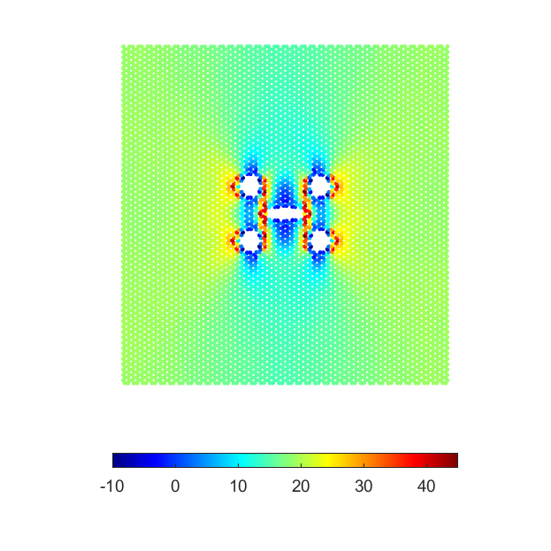

# Molecular Dynamics Simulations of Fracture of Graphene: A Tutorial
An overview of the tutorial has been given below.

 

The MATLAB code “input_files.m” generates the required two LAMMPS input files for the simulation (“grap-in.in” and “grap-data.data”). Atomic coordinates of a pristine graphene sheet (i.e. the file zz_15nm) can be obtained from [Visual Molecular Dynamics (VMD)](https://www.ks.uiuc.edu/Research/vmd/): Extensions -> Modeling -> Nanotube Builder. Alternatively, [this MATLAB code](https://github.com/nuwan-d/graphene_tensile_test/blob/master/input_files.m) can be used for that purpose. Crack length, diameter and relative positions of holes can be changed by modifying the code (between the lines 46 and 69).

The MATLAB code “stress_distribution.m” can be used to plot the stress field obtained from the MD simulations, which is shown below.

[VMD](https://www.ks.uiuc.edu/Research/vmd/) or [OVITO](https://www.ovito.org/) can be used to visulaize the progress of the uniaxial tensile test.

The MATLAB code “stress_strain_curves.m” can be used to plot the stress-strain data extracted from the MD simulation.

Another LAMMPS tutorial on modeling aluminum, polymer, and their interface is [avilable here.](https://github.com/nuwan-d/LAMMPS_tutorials_for_short_courses)
